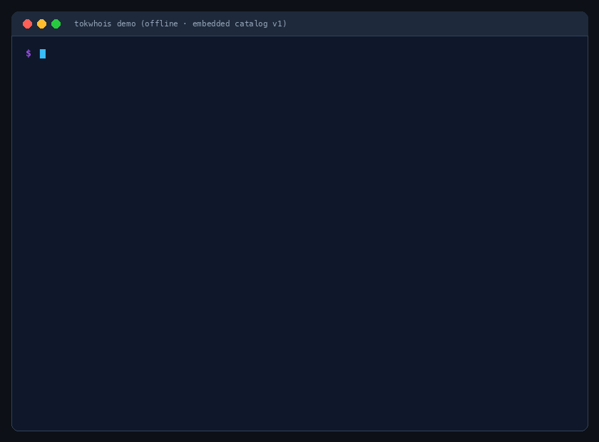
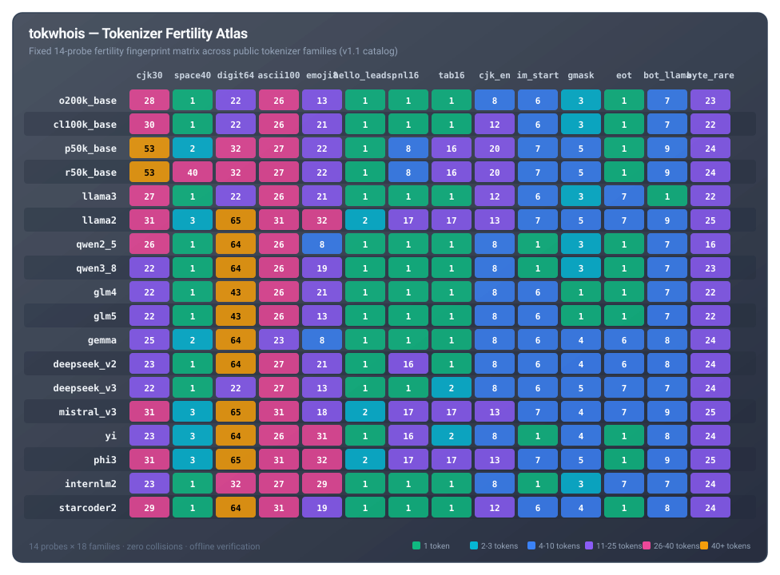

# tokwhois

**Whois for stealth LLMs.**

Labs can hide the weights, the logits, and the architecture.  
They cannot hide the tokenizer they bill you with.

```bash
uvx tokwhois demo
uvx tokwhois https://api.example.com/v1 --model stealth-7
```

[](LICENSE)
[](https://pypi.org/project/tokwhois/)



---

## What you get in 12 seconds

A 14-integer **fertility vector**. Each probe is a fixed, versioned string. The
server returns `usage.prompt_tokens` for a 1-token completion. That
integer is compared to a catalog of **public** tokenizers
(tiktoken encodings + Hugging Face `tokenizer.json`, licenses
permissive, pinned by commit/version).

```
$ tokwhois https://api.example.com/v1 --model stealth-7

family      glm4-class     confidence 1.00  (L1 distance: 0)
runner-up   cl100k_base    margin 35 tokens (L1)

probe          counted       glm4 cl100k_bas  internlm2 o200k_base
cjk30               22         22         30         23         28
space40              1          1          1          1          1
digit64             43         43         22         32         22
ascii100            26         26         26         27         26
emoji8              21         21         21         29         13
hello_leadsp         1          1          1          1          1
nl16                 1          1          1          1          1
tab16                1          1          1          1          1
cjk_en               8          8         12          8          8
im_start             6          6          6          1          6
gmask                1          1          3          3          3
eot                  1          1          1          7          1
bot_llama            7          7          7          7          7
byte_rare           22         22         22         24         23
──────────────────────────────────────────────────────────────────
offset (empty)      7   subtracted from every prompt count

n=1 probe / string   K=1   catalog=v1   2026-08-24
discriminating probes vs runner-up: cjk30, digit64, cjk_en, gmask
```

It reports a **tokenizer family**, not a checkpoint, not a lab, not
a parameter count. If the top two families land inside the margin,
it prints `ambiguous` and stops. It does not guess.

---

## Tokenizer Fertility Atlas (v1)



---

## Install

```bash
pip install tokwhois

# or, zero install:
uvx tokwhois demo
```

Python 3.10+. The demo and selftest run **offline** (stdlib + the embedded catalog).
Live mode requires `httpx`. `tiktoken` and `tokenizers` are optional
and only used to rebuild the catalog or encode local files.

---

## 5-Minute Path

### 1. Offline (no API key, no network)

```bash
tokwhois demo
```

This encodes the v1 probes against the embedded catalog, prints the vectors, and asserts
that each family matches itself at $L_1 = 0$ and the others at $L_1 > 0$.
If that assertion ever fails, the instrument is hollow — the
selftest is written to fail on purpose when the catalog collides.

### 2. Live (any OpenAI-compatible endpoint)

```bash
export OPENAI_API_KEY=...
tokwhois "$OPENAI_BASE_URL" --model "$MODEL"
```

Fourteen `max_tokens=1` calls. Fail-closed if `usage.prompt_tokens`
is missing. Chat-template framing overhead is subtracted via an empty probe
so the live vector is directly comparable to the local catalog.

### 3. Local file (you already have `tokenizer.json`)

```bash
tokwhois --local path/to/tokenizer.json
```

### 4. Machine-readable JSON output

```bash
tokwhois demo --json
tokwhois "$OPENAI_BASE_URL" --model "$MODEL" --json
```

---

## Why this works

Tokenizers are frozen at training. Stealth deployments almost
always reuse a public tokenizer because training a new one is a
research project, not a wrap. Billing requires `usage`. The
combination is a fingerprint the server computes for you.

This is not a watermark, not a logit attack, and not stylometry.
It is addition.

---

## What this is not

- **Not** a statement about model quality.
- **Not** an identification of a lab, a checkpoint, or a size.
- **Not** a benchmark. There is no leaderboard in this repository.
- **Not** a request that anyone violate a provider's terms. You run
  it against endpoints **you** are authorized to call.

Sightings of unnamed stealth endpoints belong in discussions as
**vectors**, not as accusations. The catalog only contains public
tokenizers.

---

## Method in one paragraph

Let $f$ be the unknown tokenizer. For a fixed probe set
$s_1,\ldots,s_{14}$ we observe $n_i = |f(s_i)|$ via the
billing field, minus the chat-template offset $n_\varnothing$.
The catalog stores $n_i^{(k)}$ for each public tokenizer $k$.
The report is $\arg\min_k \sum_i |n_i - n_i^{(k)}|$, with
`ambiguous` if the runner-up is within `margin` (default 2).
Every number in the report is an integer count with $n=1, K=1$.
See [METHOD.md](docs/METHOD.md) for the full formulation.

---

## License

Copyright 2026 Fabio Suizu / Brainiall.

Licensed under the Apache License, Version 2.0. See [LICENSE](LICENSE).
